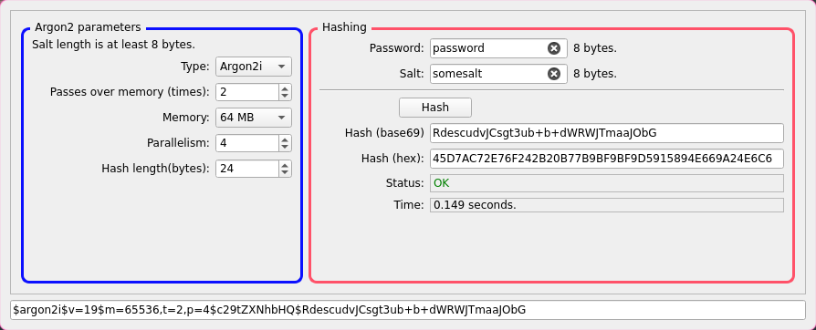

# Argon2-Calculator
A simple GUI in C++/Qt for test and bench [Argon2](https://en.wikipedia.org/wiki/Argon2).

It use the [Argon2](https://en.wikipedia.org/wiki/Argon2) implementation in [Botan](https://botan.randombit.net) library. Botan is released under the permissive [Simplified BSD](botan_license.txt) license.

- [Argon2 original C implementation](https://github.com/P-H-C/phc-winner-argon2)
- [Botan: Crypto and TLS for Modern C++](https://github.com/randombit/botan)

